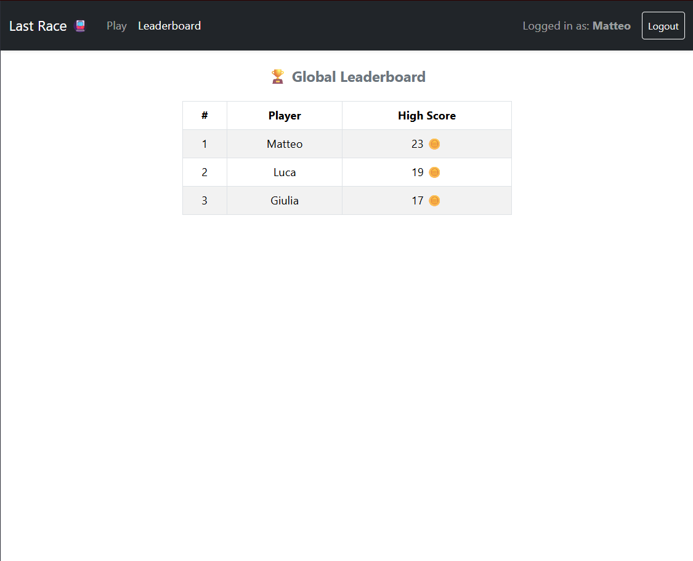
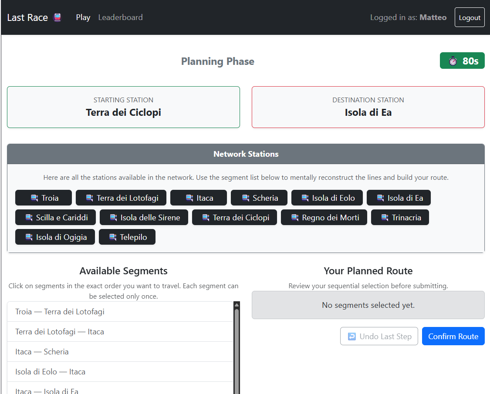

# Exam 1: "Last Race"
## Student: s358902 BENOTTO MARCO

## React Client Application Routes

- Route `/`: The application's Home Page. It displays the general game instructions for anonymous visitors and acts as the main dashboard for authenticated users to start a new game.
- Route `/login`: The authentication screen containing the controlled form for logging in via user credentials.
- Route `/game`: Manages the gameplay. It conditionally renders the 4 sub-phases (`SetupPhase`, `PlanningPhase`, `ExecutionPhase`, `ResultPhase`) based on the current match state.
- Route `/ranking`: The global leaderboard page displaying the high scores achieved by each registered user.

## API Server

- POST `/api/sessions`
  - Authenticates the user using Passport.js (LocalStrategy).
  - Request body: { "username", "password" }
  - Response body: { "id", "username" } (201 created)
- DELETE `/api/sessions/current`
  - Logs out the current user by destroying their session on the server
  - Request body: none
  - Response body: {"message": "logged out"} (200 OK)
- GET `/api/sessions/current`
  - Verifies the user's authentication status upon client-side page refreshes.
  - Request body: none
  - Response body: { "id", "username" } if authenticated (200 OK), or { "error": "..."} (401 Unauthorized).
- GET `/api/network`
  - Retrieves the complete list of stations and lines
  - Request body: none
  - Response body: { "lines", "stations", "segments"} (200 OK)
- GET `/api/network/segments`
  - Retrieves the list of all existing segments
  - Request body: none
  - Response body: {"stations", "segments"} (200 OK)
- POST `/api/games`
  - Initializes a new game session
  - Request body: none
  - Response body: The newly created game object with status setup and a starting score of 20 coins: { "id", "user_id", "start_station_id", "end_station_id", "status" (setup), "score" (20), ... } (201 Created)
- GET `/api/games/:gameId`
  - Fetches the updated state and tracking details of a specific game session of the logged user
  - Request body: none
  - Response body: Full match details (200 OK) or {"error": "..."} (404 Not Found / 403 Forbidden).
- POST `/api/games/:gameId/start`
  - Transitions the game status from setup to planning and activates the 90-second countdown timer
  - Request body: none
  - Response body: { "status" (planning), "planningDeadline"} (200 OK)
- POST `/api/games/:gameId/segments`
  - Submits the ordered sequence of segment IDs chosen by the player during the planning phase. If the deadline has expired, the partial or empty route is saved.
  - Request body: { "segmentIds"}
  - Response body: { "message": "Route registered for execution." } (201 Created)
- POST `/api/games/:gameId/execution`
  - Backend-validates the path correctness. Simulates the journey step-by-step by processing random events for each segment, updates the database log, and commits the final score
  - Request body: none
  - Response body: { "valid", "steps", "score"} (200 OK)
- GET `/api/ranking`
  - Extracts the global leaderboard records from the database
  - Request body: none
  - Response body: An array of player records:  [{ "username", "max_score" }] (200 OK)

## Database Tables

- Table `users`: Stores registered user accounts and credentials
- Table `lines`: Contains the available transit lines in the subway network
- Table `stations`: Contains all stations within the underground transit network
- Table `segments`: Represents physical, bidirectional connections between adjacent pairs of stations on a specific subway line
- Table `events`: Stores the unexpected random occurrences that can transpire during travel
- Table `games`: Tracks the lifecycle state, parameters, and results of each game session started by a user
- Table `game_segments`: A detailed logging table that captures the ordered sequence of segments selected by a player during a match, alongside the random event and net modifier applied during the execution phase

## Main React Components

- `HomePage` (in `HomePage.jsx`): It renders basic instructions for anonymous visitors or an action-ready dashboard for logged-in users.
- `LoginPage` (in `LoginPage.jsx`): It renders an input form, handling client-side submission of user credentials for logging in.
- `RankingPage` (in `RankingPage.jsx`): It renders the global high scores table.
- `GamePage` (in `GamePage.jsx`): The core state wrapper and orchestrator for gameplay. It checks active matches via APIs and conditionally renders the appropriate sub-phase component based on the game's status field.
- `SetupPhase` (in `SetupPhase.jsx`): Displays the fully revealed subway network map with all operational lines and stations before starting the planning countdown.
- `PlanningPhase` (in `PlanningPhase.jsx`): Displays the stations and provides an interactive listing interface for sequential segment selection under a strict 90-second countdown timer.
- `ExecutionPhase` (in `ExecutionPhase.jsx`): Illustrates the progressive, step-by-step travel of the user across the map, with individual random events drawn by the server and updating the active coin total.
- `ResultPhase` (in `ResultPhase.jsx`): Shows the concluding performance breakdown, displaying the final saved score and offering a quick action trigger to restart the game loop.
- `NavBar` (in `NavBar.jsx`): A persistent header bar providing routing navigation, displaying the authenticated user's profile identity, and offering the Logout trigger.

## Screenshot

## Users Credentials

- Matteo -> pw: password1
- Giulia -> pw: password2
- Luca -> pw: password3

## Use of AI Tools
I've been helped by Gemini, primarily to speed up the coding process, particularly for the bootstrap parts, SQL queries, and some purely algorithmic parts like the BFS in game generation.
I everytime took action to modify some things that weren't working well, were inconsistent, or I didn't like.